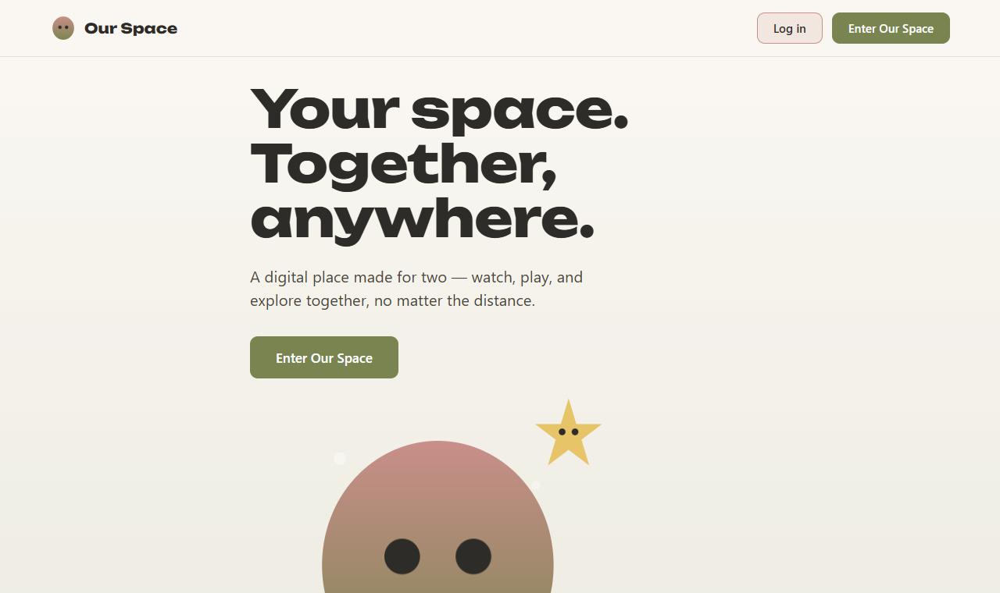
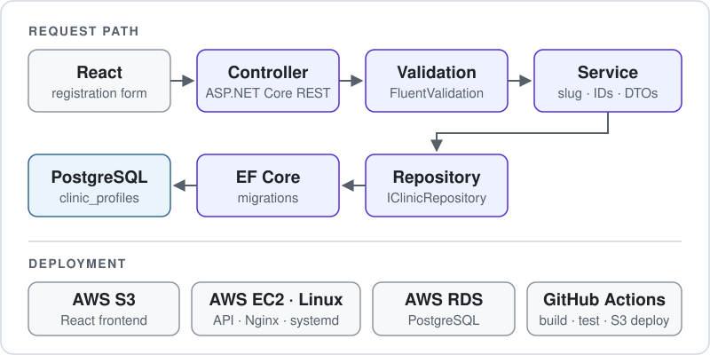

# Uche Onwe

**Software Engineer** · B.S. Computer Science, Texas A&M University–Victoria (2026) · Houston, TX

I build and deploy backend and full-stack systems: C#/.NET and Python/Django APIs, React/TypeScript frontends,
PostgreSQL, and AWS infrastructure. I test what I ship.

<a href="https://linkedin.com/in/uchechukwu-onwe-9b279a367">https://linkedin.com/in/uchechukwu-onwe-9b279a367</a> &nbsp;·&nbsp; <a href="mailto:uche0to100developer@gmail.com">uche0to100developer@gmail.com</a>

  

---

## Featured Projects

### Our Space
**A private shared space for couples who live apart. They can watch YouTube in sync, see each other's presence in real time, and build a shared room together.**
 Independent Software Engineer · Aug 2026 – present

GitHub: https://github.com/UcheOnwe/our-space
 Live: http://32.199.12.158

- **Architecture:** a Django REST Framework **modular monolith** with seven domain apps (accounts, couples, watch, presence, rooms, a virtual-currency wallet and ledger, and companions), plus a **React 19 + TypeScript** client.
- **Realtime:** synchronized YouTube playback using REST with anchor-based drift correction, with live shared presence over **WebSockets** (Django Channels on ASGI). Presence messages go to per-couple groups, and every WebSocket connection is authenticated and origin-checked.
- **Auth and data:** session-based authentication with **CSRF** protection across the SPA/API boundary, invite-based couple pairing, and **PostgreSQL**-backed shared state.
- **Quality:** I built every feature as a vertical slice on its own branch and merged it through 14 pull requests. **GitHub Actions** CI runs backend tests against PostgreSQL, checks for missing migrations, lints, type-checks, and builds. The project has **650+ passing frontend tests and 230+ backend test cases**.
- **Deployment:** containerized with **Docker** and deployed to **AWS EC2** behind **Nginx**. I provisioned the infrastructure with **Terraform**.

Python · Django · Django REST Framework · Django Channels · React · TypeScript · Vite · PostgreSQL · WebSockets · Docker · Terraform · AWS EC2 · Nginx · GitHub Actions · Vitest

 

### ClinicEngine
**A veterinary clinic-management platform built to cut manual front-desk work. Clinic onboarding is built; booking and call handling are on the roadmap.**
 Software Engineer / Technical Lead · 2-person team · May 2026 – present

GitHub: https://github.com/UcheOnwe/ClinicEngine
 Live: http://clinicengine-web.s3-website-us-east-1.amazonaws.com

- **Backend design:** an **ASP.NET Core (.NET 10)** API organized as a modular monolith, with consistent layers: controller → **FluentValidation** → service → repository → **Entity Framework Core** → **PostgreSQL**.
- **Clinic onboarding, end to end:** a React registration form, REST endpoints, field-level validation errors, server-generated IDs and booking-link slugs, relational persistence, and clinic detail pages.
- **API safety:** request and response **DTO whitelisting** stops clients from setting server-controlled fields such as id, status, and slug. Schema changes are managed with EF Core migrations.
- **Deployment:** I deployed and troubleshot the platform across **AWS EC2, RDS, and S3** using Linux, Nginx, systemd, and Security Groups. I later introduced **GitHub Actions CI/CD**: every PR gets a .NET build, xUnit tests, and a frontend build, and every merge deploys the frontend to S3 using keyless OIDC credentials.

C# · ASP.NET Core · Entity Framework Core · FluentValidation · PostgreSQL · React · Vite · AWS EC2 · RDS · S3 · Linux · Nginx · systemd · GitHub Actions · xUnit

---

## More Projects

**Receipt-to-Spending Tracker** · 5-person Agile capstone
 https://github.com/UcheOnwe/Receipts-To-Spending-Tracker
 A mobile app that turns receipt photos into structured spending records. I built backend layers (controllers, DTOs, services, repositories, EF Core). I also traced a React Native → ASP.NET Core upload failure (null file, HTTP 400) to the multipart request contract and fixed it.
 C# · ASP.NET Core · EF Core · SQLite · React Native / Expo · OpenAI API

**Nonprofit Donor Management** · Solo project
 https://github.com/UcheOnwe/NonProfitDonor_WebApp
 A donor and donation management web app. I designed the relational SQL Server schema, reverse-engineered it into EF Core entities, and built CRUD workflows with validation and Radzen data grids.
 C# · Blazor Server · SQL Server · EF Core · Radzen

---

## How I Build

**Define → Inspect → Plan → Implement → Review → Test → Verify**

I scope work as bounded tasks, each with a goal, the files it touches, allowed and forbidden changes, success criteria, and stop conditions. I ship each one as a small vertical slice on a feature branch.
I use Claude Code, Codex, and ChatGPT for repository inspection, planning, implementation, and diff review. Architecture, accepting or rejecting changes, testing, and deployment decisions stay with me.

---

## Toolbox

**Languages:** C# · Python · TypeScript · JavaScript · SQL
 **Backend:** ASP.NET Core · Django · Django REST Framework · Django Channels · Entity Framework Core · FluentValidation · REST APIs · WebSockets
 **Frontend:** React · Vite · React Native / Expo · Blazor
 **Data:** PostgreSQL · SQL Server · SQLite · relational modeling · migrations
 **Cloud & Delivery:** AWS (EC2, RDS, S3, Security Groups) · Docker · Terraform · Linux · Nginx · systemd · GitHub Actions
 **Testing:** Django test framework · Vitest · React Testing Library · xUnit

---

<b>Creative engineering: Roblox & Blender</b>

 

- **OurSpace World:** a cozy, anime-inspired social Roblox experience with personal spaces, companions, customization, and exploration. I work on movement and camera systems, UI, and world design in Roblox Studio and Luau.
- **Catch an Alien:** a rapid Roblox MVP (spawn → chase → catch → gain power → expand territory), built in phases and tuned through playtesting.
- **Blender:** learning character animation (FK/IK, movement) for Roblox R15 rigs.

 

Open to entry-level software, backend, full-stack, and cloud engineering roles · Houston, TX · Open to relocation across the U.S. · Remote

